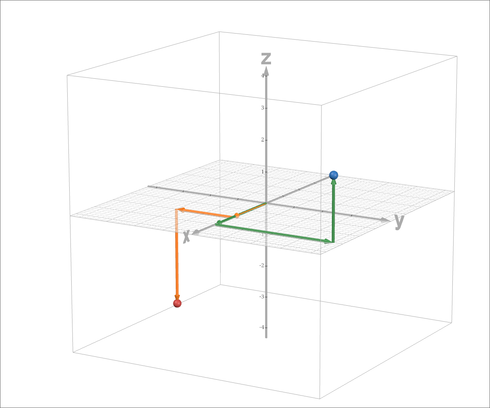
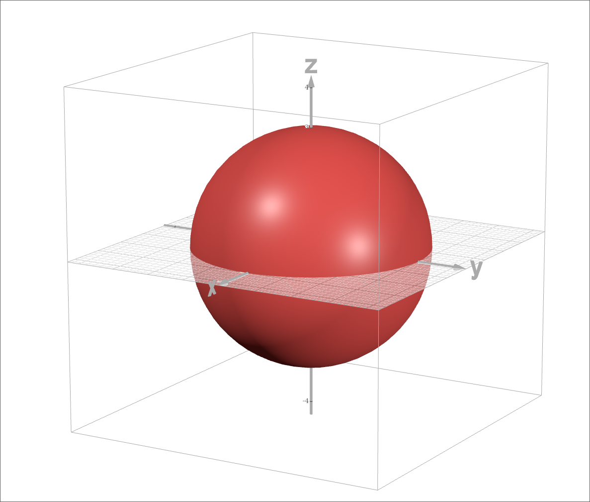
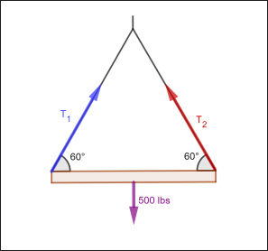

# Three dimensional Coordinate Systems

## Problem 1

Plot points $(2, -2, -3)$ and $(3,4, 2)$.

### Answer

## Problem 2

Describe the surface defined by the equation $x^2 + y^2 + z^2 = 9$ and then
graph it on the axes below.

### Answer

The surface defined by the given equation corresponds to the surface of a sphere
with radius $3$.

$\pagebreak$

# Vectors

## Problem 3

Consider the vector $(-2, 4, \sqrt{5})$. Find a unit vector in the same
direction as this vector; then find a vector of length $10$ in the same
direction of this vector.

### Answer

The unit vector in the same direction of $\hat{x}$ is equal to the scalar
product of the reciprocal of the norm of the given vector and the vector. Given
$\hat{x} = (-2, 4, \sqrt{5})$, the norm $|\hat{x}|$ is 

$$\begin{aligned}
\sqrt{(-2)^2 + 4^2 + (\sqrt{5})^2}
&= \sqrt{4 + 16 + 5} \\ 
&= \sqrt{25} \\
&= 5
\end{aligned}$$

Thus, the unit vector is $\displaystyle \left(\frac{-2}{5}, \frac{4}{5},
\frac{\sqrt{5}}{5}\right)$.

A vector of length $10$ in the same direction is the scalar product $10\hat{x} =
(-4, 8, 2\sqrt{5})$.

## Problem 4

Let $a = 8i + j - 4k$ and $b = 5i - 2j + k$. Find

1) $a + b$
2) $4a - 2b$
3) $|a|$
4) $|a-b|$

### Answer

As a remainder, $i = \langle 1, 0, 0 \rangle, j = \langle 0, 1, 0 \rangle,
k = \langle 0, 0, 1 \rangle$, or the basis of $R^3$.

#### 1)
$$\begin{aligned}
a + b &= (8+5)i + (1-2)j + (1-4)k \\
      &= 13i - j - 3k \\
      &= \langle 13, -1, -3 \rangle
\end{aligned}$$

#### 2)
$$\begin{aligned}
4a - 2b &= 4(8i +j  - 4k) - 2(5i - 2j + k) \\
        &= (32i + 4j - 16k) - (10i - 4j + 2k) \\
        &= (32-10)i + (4-4)j - (16+2)k \\
        &= 22i + 0j - 18k \\
        &= \langle 22, 0, -18 \rangle
\end{aligned}$$

As it turns out, I miscalulated the product of the $\hat{j}$ component of
$\hat{b}$ in the third line and the calculation should look like this

$$\begin{aligned}
4a - 2b &= 4(8i + j - 4k) - 2(5i - 2j + k) \\
        &= (32i + 4j - 16k) - (10i - 4j + 2k) \\
        &= (32-10)i + (4+4)j - (16+2)k \\
        &= 22i + 8j - 18k \\
        &= \langle 22, 8, -18 \rangle
\end{aligned}$$

#### 3)
$$\begin{aligned}
|a| &= |\langle 8, 1, -4 \rangle| \\
    &= \sqrt{8^2 +1^2 + (-4)^2} \\
    &= \sqrt{64 + 1 + 16} \\
    &= \sqrt{81} \\
    &= 9
\end{aligned}$$

#### 4)
$$\begin{aligned}
|a - b| &= |(8-5)i + (1+2)j - (4+1)k \\
        &= |3i + 3j - 5k| \\
        &= |\langle 3, 3, -5 \rangle|\\
        &= \sqrt{3^2 + 3^2 + (-5)^2} \\
        &= \sqrt{9 + 9 + 25} \\
        &= \sqrt{43}
\end{aligned}$$

## Problem 5

A crane suspends a $500 \text{ lbs}$ steel beam horizontally by support cables
(with negligible weight) attached from a hook to each end of the beam. The
support cables each make an angle of $60^\circ$ with the beam. Find the tension
in each support cable and the magnitude of each tension.

{width=200px}

### Answer

*Student note: At the end, I ended asking help to a math tutor. But this was
such a fun problem that reminded me of the importance of stepping back from the
context of the class.*

As a remainder, given the norm of a vector $\hat{a} \in R^2$ and the angle
$\theta$ it makes with the $x$-axis, the vector can be expressed as a linear
combination $(|\hat{a}|\cos \theta) \hat{i} + (|\hat{a}|\sin \theta) \hat{j}$.

We know from classic mechanics, that given a force in a system, there must be a
reaction of the same norm in the opposite direction. In the present system, the
crane is an object being pulled down by a gravitational force that corresponds
to the vector $-500\hat{j}$ from our referential point. Therefore, the system
also features an opposite vector of $500\hat{j}$. We also know that this force
is *equally* distributed between the cables, each forming angles of $\theta =
60^\circ = \frac{\pi}{3}$ with respect to the crane. This means that there are
forces (represented by vectors $T_1$ and $T_2$) acting along the cables.
Mathematically, we can express this as following:

$$T_1 + T_2 = 500\hat{j}$$
$$T_1 = \langle |T_1| \cos \frac{\pi}{3}, |T_1| \sin \frac{\pi}{3} \rangle$$
$$T_2 = \langle - |T_2| \cos \frac{\pi}{3}, |T_2| \sin \frac{\pi}{3} \rangle$$

In order to find the components of the vectors, we need to find their norm, which
is equal for both of them ($|T_1| = |T_2| = |T|$). And we know that the sums of
of their $y$-components is equal to $500$ ($|T_1 + T_2| \sin \theta$). Therefore:

$$\begin{aligned}
2|T| \sin \theta                        &= 500 \\
|T|                                     &= \frac{500}{2\sin\theta} \\
                                        &= \frac{(500)(2)}{2\sqrt{3}} \\
                                        &= \frac{500}{\sqrt{3}}
\end{aligned}$$

Now, we can figure out the components of both vectors. Note that $|T_1|
\cos \theta = - |T_2| \cos \theta$, as the $x$-component of both vectors
go in opposite directions.

$$\begin{aligned}
T_1     &= \langle |T_1| \cos \theta , |T_1| \sin \theta \rangle \\
        &= \langle \frac{500}{\sqrt{3}} \cdot \frac{1}{2}, \frac{500}{\sqrt{3}} \cdot \frac{\sqrt{3}}{2} \rangle \\
        &= \langle \frac{250}{\sqrt{3}}, 250 \rangle \\
\end{aligned}$$

and
$$T_2 = \langle -\frac{250}{\sqrt{3}}, 250 \rangle$$

$\blacksquare$

$\pagebreak$

# The Dot Product

## Problem 6

Let $\hat{u} = \langle 0, 1, -1 \rangle$ and $\hat{v} = \langle -1, a, 1 \rangle$
for some Real number $a$. What value of $a$ will make $\hat{u}$ and $\hat{v}$
orthogonal? What value of $a$ will produce an angle of $\frac{\pi}{3}$ between
them?

### Answer

Note that in general

$$\begin{aligned}
\hat{u} \cdot \hat{v} &= 0(-1) + 1a + (1)(-1) \\
                      &= a-1 \\
\end{aligned}$$

From this and $\forall n \in N \ge 2$, $\forall \hat{a},\hat{b} \in R^n$,
$\hat{a} \cdot \hat{b} = 0 \iff \hat{a} \perp \hat{b}$, it follows that $a = 1$
will satisfy orthogonality between $\hat{u}$ and $\hat{v}$.

$$\begin{aligned}
\hat{u} \cdot \hat{v} = a-1 &= 0 \\
                        a &= 1 \\
\end{aligned}$$

For the second question, I misunderstood the question and the relation between
the dot product and the angle between vectors. In an embarrassing episode, I
assumed that $\hat{a} \cdot \hat{b} = \theta$ and $\hat{u}\cdot\hat{v} =
\frac{\pi}{3}$ implying that $a = \frac{\pi}{3} + 1$ (faulty computation as
follows):

$$\begin{aligned}
\frac{\pi}{3} &= 0(-1) + 1a + 1(-1) \\
             &= a - 1 \\
\implies \frac{\pi}{3} + 1 &= a
\end{aligned}$$

As it turns out, and what I figured out after peeking quickly at the solution
sheet, $\hat{u} \cdot \hat{v} = |\hat{u}||\hat{v}|\cos \theta$. Let's work with
that:

Let $\theta = \frac{\pi}{3}$. Therefore, $\cos \theta = \frac{1}{2}$, and

$$\begin{aligned}
\frac{1}{2}             &= \frac{\hat{u}\cdot\hat{v}}{|\hat{u}||\hat{v}|} \\
                        &= \frac{a-1}{\sqrt{2}\sqrt{2+a^2}} \\
                        &= \frac{a-1}{\sqrt{4+2a^2}} \\
\frac{\sqrt{4+2a^2}}{2} &= a-1 \\
\sqrt{4+2a^2}           &= 2a-2 \\
4+2a^2                  &= (2a-2)^2 \\
4+2a^2                  &= 4a^2 - 8a + 4 \\
2a^2                    &= 4a^2 - 8a \\
 a^2                    &= 2a^2 - 4a \\
0                       &= a^2 - 4a \\
                        &= a(a - 4) \\
\end{aligned}$$

Which implies $a \in \{0, 4\}$. $\blacksquare$

## Problem 7

Show that the vector $\text{orth}_{\hat{a}} \hat{b} = \hat{b} -
\text{proj}_{\hat{a}} \hat{b}$ is orthogonal to $\hat{a}$. (It is called the
**orthogonal projection** of $\hat{b}$.)

### Answer

We can prove the orthogonality if the dot product of the orthogonal projection
and $\hat{a}$ is 0.

$$\begin{aligned}
\hat{a} \cdot \text{orth}_{\hat{a}} \hat{b} 
&=  \hat{a} \cdot (\hat{b} - \text{proj}_{\hat{a}} \hat{b}) \\
&=  \hat{a}\cdot (\hat{b} - \frac{\hat{a} \cdot \hat{b}}{|\hat{a}|^2} \hat{a}) \\
&= \hat{a} \cdot \hat{b} -
        \frac{\hat{a} \cdot \hat{b}}{|\hat{a}|^2} \hat{a} \cdot \hat{a} \\
&= (\hat{a}\cdot\hat{b})(1 -
        \frac{1}{|\hat{a}|^2} (\hat{a} \cdot \hat{a})) \\
&= (\hat{a}\cdot\hat{b})(1 -
        \frac{|\hat{a}|^2}{|\hat{a}|^2} ) \\
&= (\hat{a}\cdot\hat{b})(1 - 1)\\
&= (\hat{a}\cdot\hat{b})(0)\\
&= 0
\end{aligned}$$
$\blacksquare$
